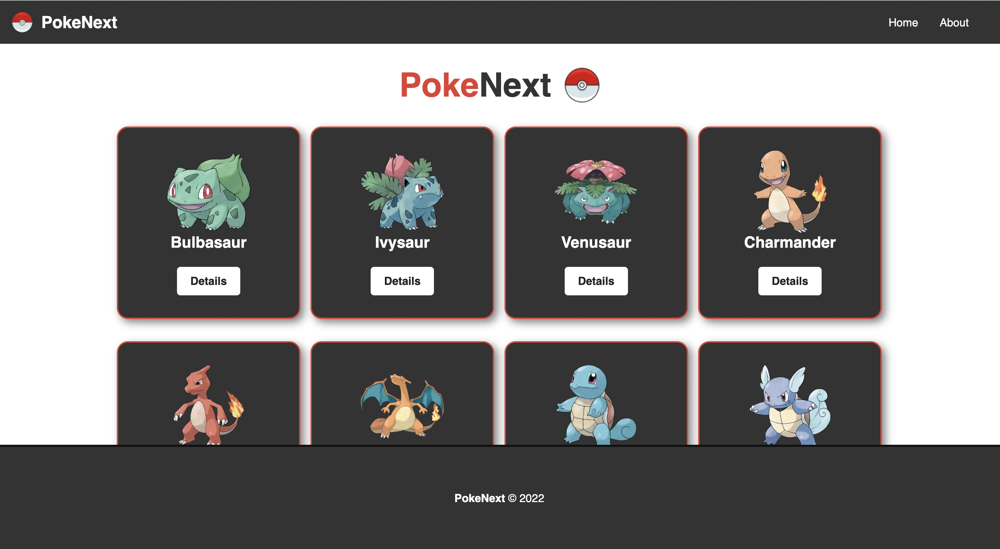
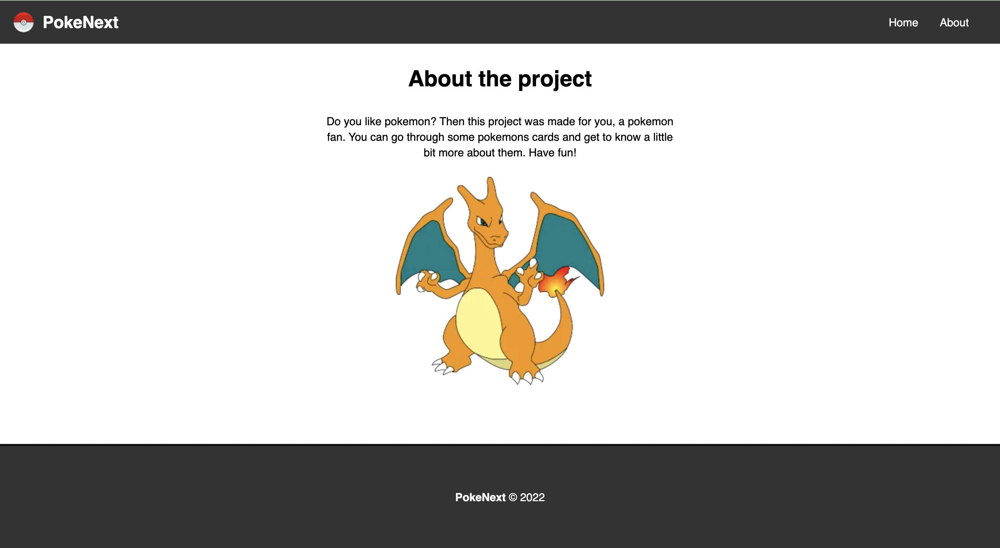
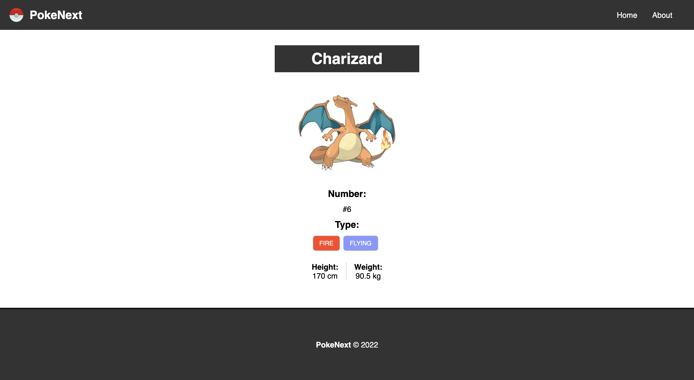

This is a Next JS Project.

## Getting Started

First, install the dependencies packages:

```bash
npm i
# or
yarn
```

Then, to start the server:

```bash
npm run dev
# or
yarn dev
```

Open [http://localhost:3000](http://localhost:3000) with your browser to see the result.


## Project images

<h1>
  <p>Home page</p>
  
</h1>

<h1>
  <p>About page</p>
  
</h1>

<h1>
  <p>Details page</p>
  
</h1>
